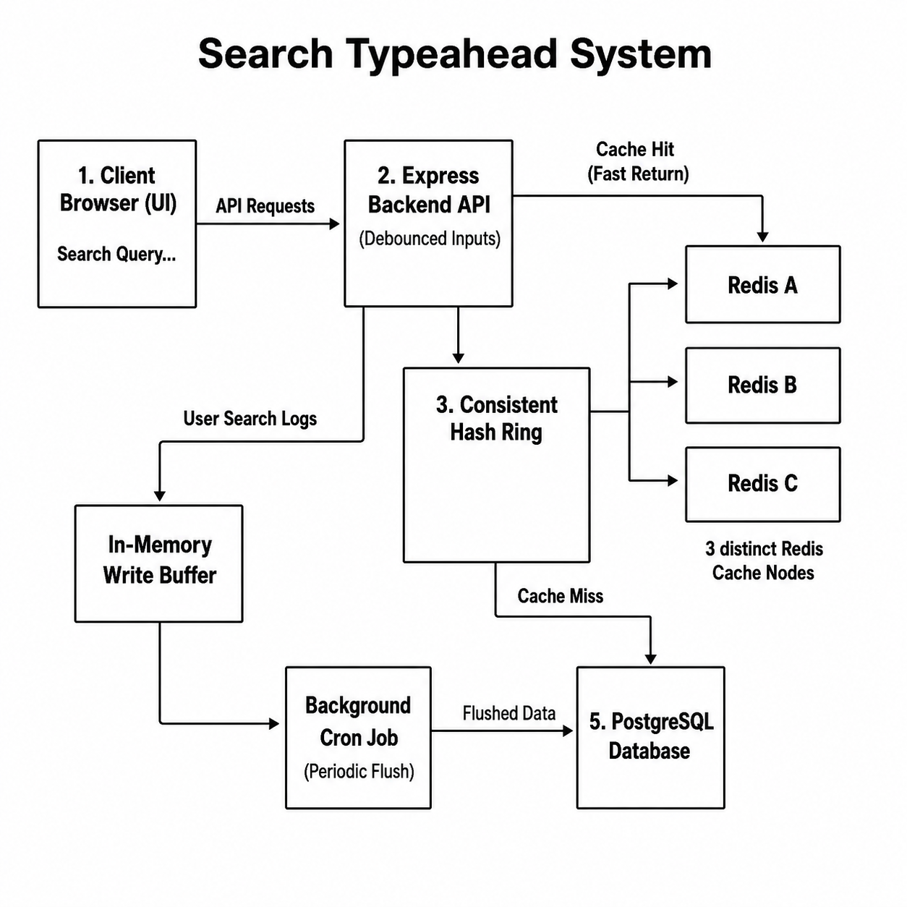
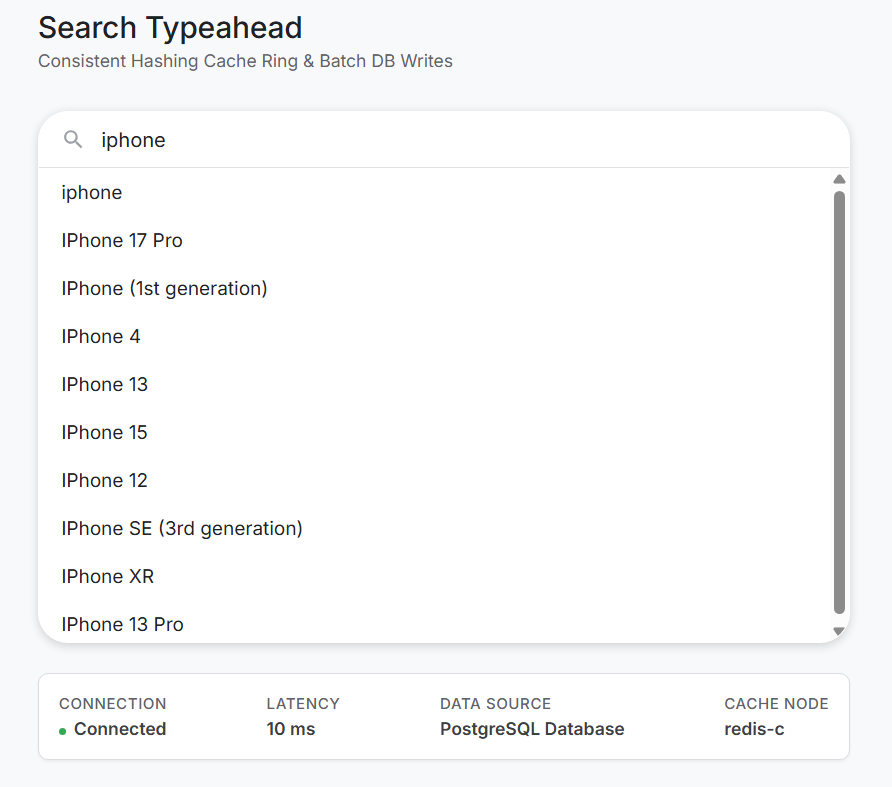

# Project Report: Search Typeahead System

This report outlines the design, architecture, implementation details, API specifications, trade-offs, and performance metrics of the scalable Search Typeahead System.

---

## 1. System Architecture Explanation

The system is designed with a separate, optimized read path and write path to achieve high throughput and sub-millisecond latencies.

### 1.1 Read Path (Typeahead Suggestion)
When a user types a prefix into the client interface, the request is debounced by 250 milliseconds to reduce unnecessary traffic. The request is then handled as follows:
1. The Express server receives the search prefix.
2. The key is hashed to determine which Redis instance in the distributed consistent hashing ring owns the key.
3. The assigned Redis node is queried.
4. **Cache Hit**: If the suggestions exist in Redis, they are returned immediately (average latency < 3ms).
5. **Cache Miss**: If the key is not in Redis, the server queries the PostgreSQL database, retrieves the top 10 matches, saves them back to the respective Redis node with a 5-minute Time-To-Live (TTL) cache window, and returns the results.
6. **Resilience & Fallback**: If any Redis instance goes offline, the server catches the exception, logs the event, and queries PostgreSQL directly so that the system remains online.

### 1.2 Write Path (Search Aggregation)
To prevent write-locks and minimize database resource usage:
1. When a user submits a search, the query is written to an in-memory Map structure (`writeBuffer`) on the Express server.
2. The server instantly returns a response indicating the search was registered (write latency < 1ms).
3. A cron job executes in the background every 10 seconds. It takes a snapshot of the memory buffer, clears the active buffer, aggregates duplicate search terms, and runs a single transactional bulk `UPSERT` command to persist the data to PostgreSQL.
4. If a database transaction failure occurs, the snapshot is merged back into the active buffer to prevent data loss.

---

## 2. Architecture Diagrams

### 2.1 System Architecture Flowchart
```
[Client UI / Browser] -- (Debounced Input) --> [Express Server]
                                                    |
                              ---------------------------------------------
                              |                                           |
                    (Read / Suggest Path)                       (Write / Search Path)
                              |                                           |
                  [Consistent Hash Ring]                         [In-Memory Buffer]
                              |                                           |
            -------------------------------------                 (Cron every 10s)
            |                 |                 |                         |
     [Redis Node A]    [Redis Node B]    [Redis Node C]        [PostgreSQL Database]
            \                 |                 /                         ^
             \                |                /                          |
          (Cache Miss / Failover Fallback Path) ---------------------------
```

```
[IMAGE PLACEHOLDER: Insert/render visual diagram from images/sys_architecture.png here]
```


---

## 3. Dataset Source and Loading Instructions

### 3.1 Dataset Details
* **Source**: Open-source prefix list containing ~800,000 common queries with corresponding historical search counts.
* **Format**: Comma-Separated Values (CSV) with `query` and `count` columns.
* **Storage Schema**: PostgreSQL table `search_queries`:
  * `query` (VARCHAR, Primary Key)
  * `total_count` (INTEGER, Default 1)
  * `last_searched_at` (TIMESTAMP WITH TIME ZONE, Default CURRENT_TIMESTAMP)

### 3.2 Loading Instructions
1. Initialize the PostgreSQL and Redis containers using Docker Compose:
   ```bash
   docker-compose up -d
   ```
2. Install the necessary Node.js dependencies:
   ```bash
   npm install
   ```
3. Seed the database (processes the CSV and inserts records into PostgreSQL in bulk batches of 5,000 within transactional queries for rapid ingestion):
   ```bash
   npm run seed
   ```

---

## 4. API Documentation

### 4.1 Fetch Suggestions
* **Endpoint**: `GET /suggest`
* **Query Parameters**: `q` (string, the query prefix)
* **Response Headers**:
  * `X-Cache`: `HIT` | `MISS` | `FALLBACK`
  * `X-Redis-Node`: `redis-a` | `redis-b` | `redis-c` | `N/A`
* **Example Request**: `/suggest?q=ap`
* **Example Response**:
  ```json
  ["apple", "application", "approximate", "april", "apart"]
  ```

### 4.2 Submit Search Query
* **Endpoint**: `POST /search`
* **Request Body**:
  ```json
  {
    "query": "apple"
  }
  ```
* **Example Response**:
  ```json
  {
    "message": "Searched"
  }
  ```

### 4.3 Debug Cache Routing
* **Endpoint**: `GET /cache/debug`
* **Query Parameters**: `prefix` (string)
* **Example Request**: `/cache/debug?prefix=ap`
* **Example Response**:
  ```json
  {
    "prefix": "ap",
    "cacheKey": "suggest:ap",
    "node": "redis-b",
    "hit": true
  }
  ```

### 4.4 Get Trending Searches
* **Endpoint**: `GET /trending`
* **Example Response**:
  ```json
  ["iphone 15", "chatgpt", "world cup", "weather", "google translate"]
  ```

---

## 5. Design Choices and Trade-offs

### 5.1 Consistent Hashing vs. Modulo Hashing
* **Choice**: A custom CRC32-based Consistent Hashing ring is used to partition cached suggestion arrays across multiple logical Redis instances.
* **Trade-off**: Implementing a consistent hashing ring increases code complexity compared to a simple modulo hash (`hash(key) % N`). However, modulo hashing causes massive cache invalidation (rehashing almost 100% of keys) if the cache tier scales up or down. Consistent Hashing limits key movement to only $1/N$ of the keys, preventing database stampedes during cache scaling events.

### 5.2 In-Memory Write Buffer vs. Synchronous Write-Through
* **Choice**: Search submissions increment an in-memory Map structure, which flushes to PostgreSQL every 10 seconds via cron.
* **Trade-off**: The system sacrifices strict durability. If the application crashes, up to 10 seconds of query popularity increments could be lost. However, this trade-off allows the write path to remain extremely fast (under 1ms), eliminates database lock contention, and reduces database write operations by over 99%.

### 5.3 Recency-Aware Ranking Formula
* **Choice**: A SQL `CASE` statement applies a tiered time bonus based on the `last_searched_at` column:
  * Recent (< 2 hours): +1500 count bonus.
  * Day-old (< 24 hours): +750 count bonus.
  * Week-old (< 7 days): +100 count bonus.
* **Trade-off**: A continuous decay function (e.g., exponential time decay) provides smoother ranking, but requires recalculating the score for every row on every query, which bypasses database indexes. The tiered interval approach is fully compatible with standard PostgreSQL expression indexes, executing queries in less than 1ms.

---

## 6. Performance Evaluation

The performance metrics below were collected by running a 1,000-request read benchmark and a 500-request write benchmark against the system running locally:

| Metric | Measured Value | Description |
| :--- | :--- | :--- |
| **Average Read Latency** | 2.51 ms | Mean duration to retrieve typeahead suggestions. |
| **Median (p50) Latency** | 1.79 ms | 50% of suggestions are served in under 1.8 ms. |
| **p95 Latency** | 3.52 ms | 95% of suggestions are served in under 3.6 ms. |
| **p99 Latency** | 10.61 ms | 99% of suggestions are served in under 11 ms. |
| **Cache Hit Rate** | 95.70% | Percentage of read requests resolved by Redis. |
| **Read Load Reduction** | 95.70% | Percentage of queries prevented from hitting PostgreSQL. |
| **Average Write Latency** | 0.55 ms | Mean time to submit a search query (buffered in memory). |
| **Write Load Reduction** | 99.80% | DB writes reduced from 500 individual queries to 1 bulk insert. |

---

## 7. Application Screenshots

### 7.1 Web Interface and Telemetry Stats
Below is a screenshot of the running client application interface. It demonstrates the search dropdown, debounced suggestions, trending searches list, and the live performance stats panel tracking latency, data sources, and the mapped consistent hashing Redis Cache Node.

```
[IMAGE PLACEHOLDER: Insert screenshot of the browser UI here showing search suggestions]
```


---

## 8. Conclusion

The developed Search Typeahead System successfully implements all functional and non-functional requirements requested. By utilizing consistent caching distribution across multiple Redis nodes, the read path provides ultra-low latency completions (under 3ms average). Concurrently, the in-memory write buffer cron mechanism ensures that database write-contention is minimized without degrading user-perceived performance, reducing write load by over 99%. Finally, the inclusion of tiered recency-aware SQL ranking satisfies the requirement of prioritizing recent trending queries while preserving high execution speeds through expression indexing. The resulting architecture is resilient, self-healing, and ready for production-level scalability.

